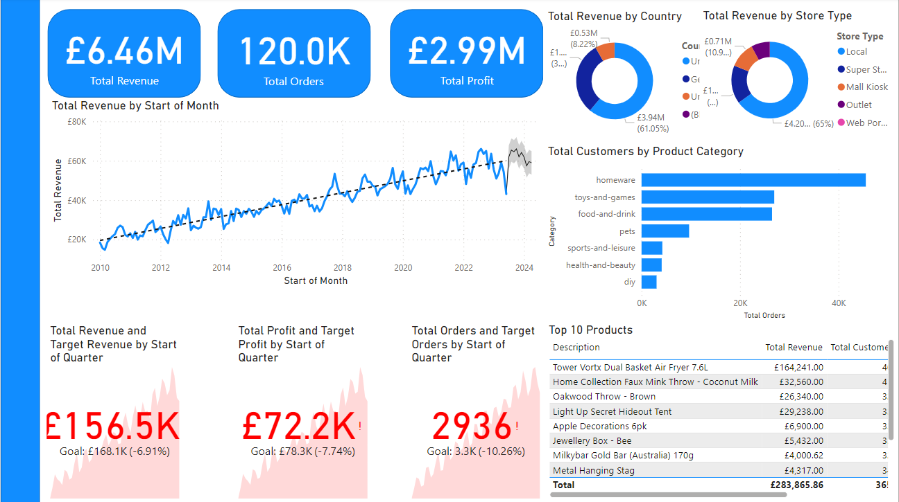
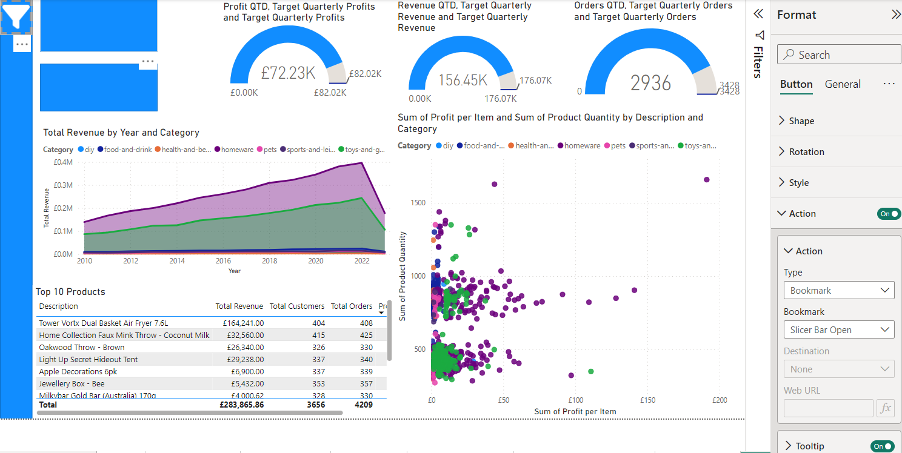
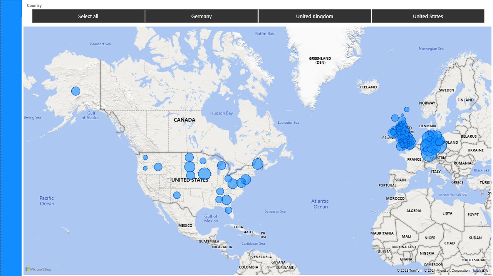

# Data Analytics Power BI Report

In this fictious scenario I have recently been approached by a medium-sized international retailer who is keen on elevating their business intelligence practices. With operations spanning across different regions, they've accumulated large amounts of sales from disparate sources over the years.

Recognizing the value of this data, they aim to transform it into actionable insights for better decision-making. My goal is to use Microsoft Power BI to design a comprehensive Quarterly report. This will involve extracting and transforming data from various origins, designing a robust data model rooted in a star-based schema, and then constructing a multi-page report.

The report will present a high-level business summary tailored for C-suite executives, and also give insights into their highest value customers segmented by sales region, provide a detailed analysis of top-performing products categorised by type against their sales targets, and a visually appealing map visual that spotlights the performance metrics of their retail outlets across different territories.

## Data Loading and Preparation

I connected to an Azure SQL database, a Microsoft Azure Storage Account, and web-hosted CSV files to import useful data for this dataset. I cleaned and organized the data by removing irrelevant columns, splitting date-time details, and ensuring data consistency. I also renamed columns to fit Power BI conventions.

I connected to the Azure SQL Database and imported the orders_powerbi table using the Import option in Power BI. 

The Orders table is the main fact table. It contains information about each order, including the order and shipping dates, the customer, store and product IDs for associating with dimension tables, and the amount of each product ordered. Each order in this table consists of an order of a single product type, so there is only one product code per order. 

I used the Power Query Editor and delete the column named [Card Number] to ensure data privacy.

I used the Split Column feature to separate the [Order Date] and [Shipping Date] columns into two distinct columns each: one for the date and another for the time

I filtered out and removed any rows where the [Order Date] column has missing or null values to maintain data integrity

I renamed the columns in my dataset to align with Power BI naming conventions (e.g. captilaisign first letters, using spaces instead of underscores), ensuring consistency and clarity in your report

I downloaded the Products.csv file  and then used Power BI's Get Data option to import the file into my project.

The Products table contains information about each product sold by the company, including the product code, name, category, cost price, sale price, and weight.

In the Data view, I used the Remove Duplicates function on the product_code column to ensure each product code is unique.

In Power Query Editor, I used the Column From Examples feature to generate two new columns from the weight column - one for the weight values and another for the units (e.g. kg, g, ml). 

For the newly created units column, replaced any blank entries with kg using the Replace Values feature.
I converted the data type of the values column to a decimal number
I replaced error values with the number 1

In the Data view, I created a new calculated column, such that if the unit in the units column is not kg, divide the corresponding value in the values column by 1000 to convert it to kilograms.

I returned to the Power Query Editor and delete any columns that are no longer needed.

I renamed the columns in your dataset to match Power BI naming conventions, ensuring a consistent and clear presentation in my report.

I used Power BI's Get Data option to connect to Azure Blob Storage and import the Stores table into my project. The Stores table contains information about each store, including the store code, store type, country, region, and address.

I downloaded the Customers.zip file - inside the zip file is a folder containing three CSV files, each with the same column format, one for each of the regions in which the company operates.

I used the Get Data option (using the Folder data connector) in Power BI to import the Customers folder into my project. I selected Combine and Transform to import the data; Power BI automatically appended the three files into one query.

Once the data are loaded into Power BI, I create a Full Name column by combining the [First Name] and [Last Name] columns using the DAX language's CONCATENATE function.

I delete any obviously unused columns (eg. index columns) and renamed the remaining columns to align with Power BI naming conventions.

## Creating the Data Model

### Generating the date table

I created a date table running from the start of the year containing the earliest date in the Orders['Order Date'] column to the end of the year containing the latest date in the Orders['Shipping Date'] column usign the DAX formula:

Dates = CALENDAR(
STARTOFYEAR(Orders[Order Date]), 
ENDOFYEAR(Orders[Shipping Date])
)

Day Of Week = WEEKDAY(Dates[Date],2)

Month = MONTH(Dates[Date])

Month Name = FORMAT(DATE(1, Dates[Month], 1), "MMMM")

Quarter = QUARTER(Dates[Date])

Year = YEAR(Dates[Date])

Start of Year = STARTOFYEAR(Dates[Date])

Start of Quarter = STARTOFQUARTER(Dates[Date])

Start of Month = STARTOFMONTH(Dates[Date])

Start of Week = Dates[Date] - WEEKDAY(Dates[Date],2) + 1

### Building the Star Schema data model

I created relationships between the tables to form a star schema. The relationships are as follows:

Orders[product_code] to Products[product_code]
Orders[Store Code] to Stores[store code]
Orders[User ID] to Customers[User UUID]
Orders[Order Date] to Date[date]
Orders[Shipping Date] to Date[date]

I ensured that the relationship between Orders[Order Date] and Date[date] is the active relationship, and that all relationships are one-to-many, with a single filter direction from the one side to the many side

### Creating a Measures table

Creating a separate table for measures is a best practice that will help keep the data model organized and easy to navigate. 

I created a new table in the data Model View with Power Query Editor. It is generally better to use the latter approach, as it makes the measures table visible in the Query Editor, which is useful for debugging and troubleshooting.

### Create key measures

I created some of the key measures that will be used in the report. These give me a starting point for building the analysis:

I created a measure called Total Orders that counts the number of orders in the Orders table:

Total Orders = COUNTROWS(Orders)

I created a measure called Total Revenue that multiplies the Orders[Product Quantity] column by the Products[Sale Price] column for each row, and then sums the result:

Total Revenue = SUMX(Orders, Orders[Product Quantity] * RELATED(Products[Sale Price]))

I created a measure called Total Profit which performs the following calculation: For each row, subtract the Products[Cost_Price] from the Products[Sale_Price], and then multiply the result by the Orders[Product Quantity]. then, it sums the result for all rows:

Total Profit = SUMX(Orders, (RELATED(Products[Sale Price]) - RELATED(Products[Cost Price])) * Orders[Product Quantity])

I created a measure called Total Customers that counts the number of unique customers in the Orders table:

Total Customers = DISTINCTCOUNT(Orders[User ID])

I created a measure called Total Quantity that counts the number of items sold in the Orders table:

Total Quantity = SUM(Orders[Product Quantity]) 

I created a measure called Profit YTD that calculates the total profit for the current year:

Profit YTD = TOTALYTD(SUMX(Orders, (RELATED(Products[Sale Price]) - RELATED(Products[Cost Price])) * Orders[Product Quantity]), Orders[Order Date])

I created a measure called Revenue YTD that calculates the total revenue for the current year:

Revenue YTD = TOTALYTD(SUMX(Orders, RELATED(Products[Sale Price]) * Orders[Product Quantity]), Orders[Order Date])

### Create Date and Georgraphy hierarchies

Hierarchies allow me to drill down into the data and perform granular analysis within the report. I created two hierarchies in this task: one for dates, to facilitate drill-down in my line charts, and one for geography, to allow me to filter the data by region, country and province/state.

I created a date hierarchy using the following levels:

Start of Year

Start of Quarter

Start of Month

Start of Week

Date

I created a new calculated column in the Stores table called Country that creates a full country name for each row, based on the Stores[Country Code] column, according to the following scheme:
GB : United Kingdom
US : United States
DE : Germany

Here is the DAX language formula:

Country = SWITCH([Country Code], 
"GB", "United Kingdom",
"US", "United States",
"DE", "Germany")

In addition to the country hierarchy, it can sometimes be helpful to have a full geography column, as in some cases this makes mapping more accurate. I created a new calculated column in the Stores table called Geography that creates a full geography name for each row, based on the Stores[Country Region], and Stores[Country] columns, separated by a comma and a space:

Geography = CONCATENATE(CONCATENATE(Stores[Country Region], ", "), Stores[Country])

I ensured that the following columns have the correct data category assigned, as follows:

World Region : Continent

Country : Country

Country Region : State or Province

I created a Geography hierarchy using the following levels:

World Region

Country

Country Region

## Building the Customer Detail Page

I created a report page focussed on custoemr-level analysis.

I created headline card visuals: I created two rectangles as the backgrounds for the card visuals and added a card visual for the [Total Customers] measure I created earlier and renamed the field Unique Customers.

I created a new measure in my Measures Table called [Revenue per Customer], which is the [Total Revenue] divided by the [Total Customers]:

Revenue per Customer = DIVIDE([Total Revenue], [Total Customers])

I added a card visual for the [Revenue per Customer] measure.

I created summary charts: I added a Donut Chart visual showing the total customers for each country, using the Users[Country] column to filter the [Total Customers] measure:

I added a Column Chart visual showing the number of customers who purchased each product category, using the Products[Category] column to filter the [Total Customers] measure:

I added a Line Chart visual to the top of the page. It shows [Total Customers] on the Y axis, and uses the created Date Hierarchy for the X axis. Users area allowed to drill down to the month level, but not to weeks or individual dates.

I added a trend line, and a forecast for the next 10 periods with a 95% confidence interval:

I created a new table which displays the top 20 customers, filtered by revenue. The table shows each customer's full name, revenue, and number of orders.

I added conditional formatting to the revenue column, to display data bars for the revenue values.

I created  a set of three card visuals that provide insights into the top customer by revenue. They display the top customer's name, the number of orders made by the customer, and the total revenue generated by the customer.

I added a date slicer to allow users to filter the page by year, using the "between" slicer-style.

## Creating an Executive Summary Page

I created a page to give an overview of the company's performance as a whole, so that C-suite executives and quickly get insights and check otucomes against key targets. 

I created cards visuals for my Total Revenue, Total Orders and Total Profit measures. I used the Format > Callout Value pane to ensure no more than 2 decimal places in the case of the revenue and profit cards, and only 1 decimal place in the case of the Total Orders measure.

I added a revneue trendign line chart by copying the line graph from my Customer Detail page, and change the Y-axis to Total Revenue.

I added a pair of donut charts, showing Total Revenue broken down by Store[Country] and Store[Store Type] respectively.

I added  a bar chart showing number of orders by product category. I copied the Total Customers by Product Category donut chart from the Customer Detail page

I went to the visual's "Build a visual" pane to change the visual type to Clustered bar chart

I changed  the X-axis field from Total Customers to Total Orders

With the Format pane open, I clicked on one of the bars to bring up the Colors tab, and sleeced a colour from my chsoen theme.

###  KPI Visuals

I created KPIs for Quarterly Revenue, Orders and Profit. 

I created a set of new measures for the quarterly targets:

Previous Quarter Profit

Previous Quarter Revenue

Previous Quarter Orders

Target Profit, Revenue, and Orders, equal to 5% growth in each measure compared to the previous quarter e.g.

Target Profit = 1.05 * [Previous Quarter Profit]

I was then able to create a  KPI visual for the revenue:

The Value field is Total Revenue

The Trend Axis is Start of Quarter

The Target is Target Revenue

In the Format pane, I set the Trend Axis to On, expand the associated tab, and set the values as follows:

Direction : High is Good
Bad Colour : red
Transparency : 15%

I formatted the Callout Value so that it only shows to 1 decimal place

I duplicated the card two more times, and set the appropriate values for the Profit and Orders cards.

## Product Detail Page

### Gauge Visuals

I added a set of three gauges, showing the current-quarter performance of Orders, Revenue and Profit against a quarterly target. The CEO had told me that they were targeting 10% quarter-on-quarter growth in all three metrics.

In my measures table, I defined DAX measures for the three metrics, and for the quarterly targets for each metric. I used the TOTALQTD and CALCULATE functions to calculate the cumulative values and the target values based on the 10% growth rate.

I created three gauge visuals, and assigned the measures I had created. In each case, the maximum value of the gauge was set to the target, so that the gauge showed as full when the target was met.

I applied conditional formatting to the callout value (the number in the middle of the gauge), so that it showed as red if the target was not yet met, and black otherwise. I used different colours if it fit better with my colour scheme.

I arranged my gauges so that they were evenly spaced along the top of the report, but left another similarly-sized space for the card visuals that displayed which slicer states were currently selected. I used the alignment and distribution tools to adjust the position and size of my visuals.

### Filter State Cards

To the left of the gauges, I put some placeholder shapes for the cards which will show the filter state. Using a colour in keeping with my theme, I added two rectangle shapes. I will sort out the values for these later on, once I had added the slicer panel.

### Area Chart of Revenue by Product Category

I wanted to add an area chart that showed how the different product categories were performing in terms of revenue over time.

I added a new area chart, and applied the following fields:

X axis is Dates[Start of Quarter]
Y axis is Total Revenue
Legend is Products[Category]

### Top 10 Product Table

I created a table of Top 10 Products ranked by Total Orders. The table has the followign fields:

the following fields:

Product Description
Total Revenue
Total Customers
Total Orders
Profit per Order

I created a new measure of Profit per Order = DIVIDE([Total Profit], [Total Orders])

### scatter graph

The products team wanted to know which items to suggest to the marketing team for a promotional campaign. They wanted a visual that allowed them to quickly see which product ranges were both top-selling items and also profitable. A scatter graph is ideal for this job.

I created a new calculated column called [Profit per Item] in my Products table, using a DAX formula to work out the profit per item:

Profit per Item = [Sale Price] -  [Cost Price]

I added a new Scatter chart to the page, and configured it as follows:

Values are Products[Description]
X-Axis is Products[Profit per Item]
Y-Axis is Products[Total Quantity]
Legend is Products[Category]

### Slicer Toolbar

Slicers were a handy way for me to control how the data on a page were filtered, but adding multiple slicers cluttered up the layout of my report page.

A professional-looking solution to this issue was to use Power BI’s bookmarks feature to create a pop-out toolbar which could be accessed from the navigation bar on the left-hand side of my report.

I downloaded a collection of custom icons. I used these for all of my navigation bar icons.

I added a new blank button to the top of my navigation bar, set the icon type to Custom in the Format pane, and chose Filter_icon.png as the icon image. I also set the tooltip text to Open Slicer Panel.

I added a new rectangle shape in the same colour as my navigation bar. Its dimensions were the same height as the page, and about 3-5X the width of the navigation bar itself. I opened the Selection pane and brought it to the top of the stacking order.

I added two new slicers. One was set to Products[Category], and the other to Stores[Country]. I changed the titles to Product Category and Country respectively.

They are in Vertical List slicer style.
It is possible to select multiple items in the Product Category slicer, but only one option at a time is selectable in the Country slicer
I configured the Country slicer so that there is a Select All option.
I ensured the formatting is neat, and fit with my chosen report style.
In the Selection pane I grouped the slicers with my slicer toolbar shape.

I needed to add a Back button so that I could hide the slicer toolbar when it is not in use.

I added a new button, and selected the Back button type. I positioned it somewhere sensible, in the top-right corner of the toolbar.
In the Selection pane, I dragged the back button into the group with the slicers and toolbar shape.

I opened the Bookmarks pane and added two new bookmarks: I created one bookmark with the toolbar group hidden in the Selection pane, and one with it visible. I named them Slicer Bar Closed and Slicer Bar Open. I right-clicked each bookmark in turn, and ensured that Data was unchecked. This prevents the bookmarks from altering the slicer state when I opened and closed the toolbar.

The final step was to assign the actions on my buttons to the bookmarks. I opened the Format pane and turned the Action setting on for both my Filter button and my Back button. For each button, I set the Type to Bookmark, and selected the appropriate bookmark. 

Finally, I tested my buttons and slicers (I remembered I needed to Ctrl-Click to use buttons while designing the report in Power BI Desktop).

## Stores Map Page

The regional managers requested a reprot page that allows them to easily check on the stores under their control, allowign them to see which of the stroes they are responsible are msot profitable, as well as which are on track to reach their quarterly profit and revenue targets. 

The best way to do this is using a map visual.

### Map Visual

I added a new map visual on the Stores Map page. It took up the majority of the page, just leaving a narrow band at the top of the page for a slicer. I set the style to my satisfaction in the Format pane, and made sure Show Labels was set to On.

I set the controls of my map as follows:
    Auto-Zoom: On
    Zoom buttons: Off
    Lasso button: Off

I assigned my Geography hierarchy to the Location field, and ProfitYTD to the Bubble size field.

### Country Slicer

I added a slicer above the map, set the slicer field to Stores[Country], and in the Format section I set the slicer style as Tile and the Selection settings to Multi-select with Ctrl/Cmd and Show "Select All" as an option in the slicer.

### Stores Drillthrough Page

I wanted to make it easy for the region managers to check on the progress of a given store, so I created a drillthrough page that summarised each store's performance. This included the following visuals:

A table showing the top 5 products, with columns: Description, Profit YTD, Total Orders, Total Revenue
A column chart showing Total Orders by product category for the store
Gauges for Profit YTD against a profit target of 20% year-on-year growth vs. the same period in the previous year. The target used the Target field, not the Maximum Value field, as the target changed as we moved through the year.
A Card visual showing the currently selected store

I created a new page named Stoes Drillthrough. I opened the format pane and expanded the Page information tab. I set the Page type to Drillthrough and set Drill through when to Used as category. I set Drill through from to country region.

I needed some measures for the gauges as follows:

    Profit YTD and Revenue YTD: I had already created this earlier in the project
    Profit Goal and Revenue Goal, which were a 20% increase on the previous year's year-to-date profit or revenue at the current point in the year

I added the visuals to the drillthrough page.
